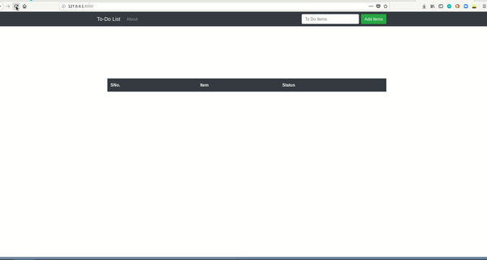

<p align=center>

</p>

[](https://github.com/nightwarrior-xxx/ToDoList/issues)  [](https://github.com/nightwarrior-xxx/ToDoList/network/members)  [](hhttps://github.com/nightwarrior-xxx/ToDoList/stargazers)          [](https://twitter.com/intent/follow?screen_name=nightwarrior_xx)  [](https://telegram.me/nightwarrior_xxx)


## :ledger: Index

- [About](#beginner-about)
- [Development](#wrench-development)
  - [Pre-Requisites](#notebook-pre-requisites)
  - [Developmen Environment](#nut_and_bolt-development-environment)
  - [File Structure](#file_folder-file-structure) 
- [Uses](#star2-uses)
- [Community](#cherry_blossom-community)
  - [Contribution](#fire-contribution)
  - [Branches](#cactus-branches)
  - [Guideline](#exclamation-guideline)  
- [Gallery](#camera-gallery)
- [Credit/Acknowledgment](#star2-creditacknowledgment)
- [License](#lock-license)

##  :beginner: About
TodoList is a web application that keeps your day to day tasks at one place. You can add tasks that you need to perform in your daily life and complete it within a time limit.

##  :wrench: Development
Everyone is welcome to contribute just follow the steps.

### :notebook: Pre-Requisites
List all the pre-requisites the system needs to develop this project.
- Basic knowledge on virtual environment
- Minimal knowledge of django

###  :nut_and_bolt: Development Environment


#### 1. Create & activate the virtual environment 

```Bash
python3 -m venv test
source test/bin/activate 
```
#### 2. Clone the Repository 

```Bash
git clone https://github.com/nightwarrior-xxx/ToDoList.git
cd ToDoList 
```
#### 3. Install the dependencies 

```BASH
pip install -r requirements.txt
```

#### 4. Create a super user & Run server: 

```BASH
python3 manage.py createsuperuser 

```

###  :file_folder: File Structure

```
├── LICENSE
├── notes.md
├── README.md
├── requirements.txt
├── todolist
│   ├── db.sqlite3
│   ├── manage.py
│   ├── static
│   │   ├── css
│   │   │   └── style.css
│   │   ├── img
│   │   └── js
│   ├── todolist
│   │   ├── __init__.py
│   │   ├── settings.py
│   │   ├── urls.py
│   │   └── wsgi.py
│   └── todolist_app
│       ├── admin.py
│       ├── apps.py
│       ├── forms.py
│       ├── __init__.py
│       ├── migrations
│       │   ├── 0001_initial.py
│       │   ├── __init__.py
│       ├── models.py
│       ├── templates
│       │   ├── about.html
│       │   ├── base
│       │   │   ├── css.html
│       │   │   ├── js.html
│       │   │   └── navbar.html
│       │   ├── base.html
│       │   ├── home.html
│       │   └── snippets
│       │       ├── edit.html
│       │       └── list.html
│       ├── tests.py
│       ├── urls.py
│       └── views.py

```
## :star2: Uses
- It makes you feel amazing and reduce the burden to remember you daily tasks.
- Saves your times and let you complete things fastly by bringing your daily tasks at one place.

## :cherry_blossom: Community


 ###  :fire: Contribution

 Your contributions are always welcome and appreciated. Following are the things you can do to contribute to this project.

 1. **Report a bug** <br>
 If you think you have encountered a bug, and I should know about it, feel free to report by making an issue and I will take care of it.

 2. **Request a feature** <br>
 You can also request for a feature. Just make an issue, and if it will viable, it will be picked for development.  

 3. **Create a pull request** <br>
 It can't get better then this, your pull request will be appreciated.

 ### :cactus: Branches

 I use an agile continuous integration methodology, so the version is frequently updated and development is really fast.

1. **`master`** is the production branch.

**Steps to work with feature branch**

1. To start working on a new feature, create a new branch prefixed with `FEATURE` and followed by feature name. (ie. `FEATURE-<feature name>`)
2. Once you are done with your changes, you can raise PR.

**Steps to create a pull request**

1. Make a PR with `dev` branch.
2. Comply with the best practices and guidelines e.g. where the PR concerns visual elements it should have an image showing the effect.

After this, changes will be merged.

### :exclamation: Guideline
Make sure that there is onle one extra line after the file ends and remember the indentation.

##  :camera: Gallery

<p align=center>

</p>

## :star2: Credit/Acknowledgment
Credits goes to me

##  :lock: License
[LICENSE](/LICENSE)
